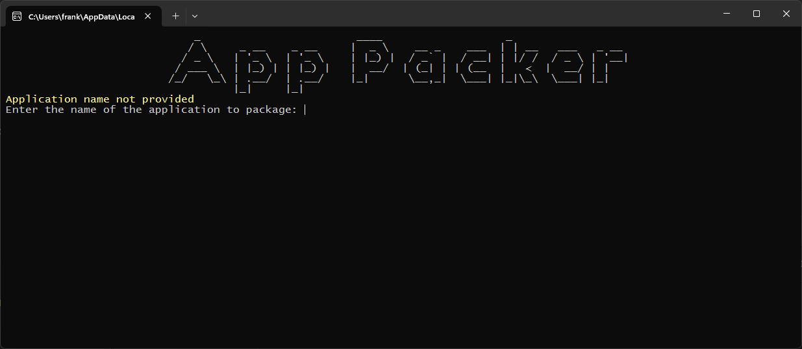
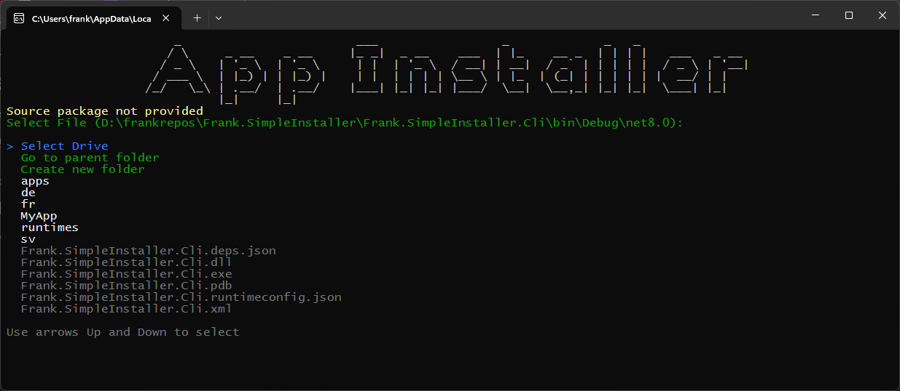
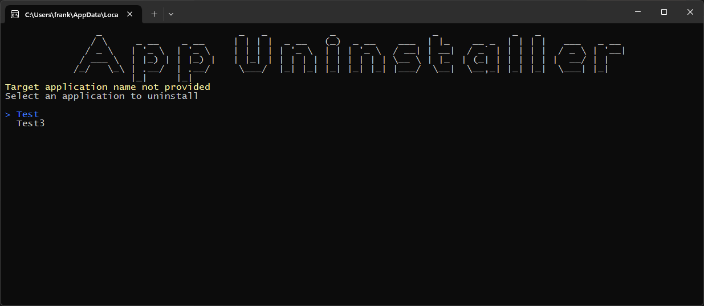

# Frank.SimpleInstaller

A simple cross-platform installer tool for dotnet. It is designed to be used with the simplest of dotnet applications. It is not intended to be a full-featured installer tool.

[](LICENSE)
[](https://www.nuget.org/packages/Frank.SimpleInstaller)
[](https://www.nuget.org/packages/Frank.SimpleInstaller)


## Installation

Install the tool using the following command:

```bash
dotnet tool install --global Frank.SimpleInstaller.Cli
```

## Simple Usage

Simple usage means that you don't provide any additional configuration. The tool will use prompt the user for the necessary information.

#### Running the following command to start and be prompted what command to run:

```bash
dotnet simple-installer
```


#### Running the following command to package an application:

```bash
dotnet simple-installer pack
```



#### Running the following command to install an application:

```bash
dotnet simple-installer install
```



#### Running the following command to uninstall an application:

```bash
dotnet simple-installer uninstall
```



## Advanced Usage

Advanced usage means that you provide arguments to the tool to avoid user input (some is still required at the moment).

#### Running the following command to package an application:

```bash
dotnet simple-installer pack --source "C:\temp\MyApp" --output "C:\temp" --executable "MyApp.exe" --version "1.0.0" --name "MyApp"
```

```bash
OPTIONS:
    -h, --help                       Prints help information
    -s, --source <SOURCE>            Source directory to pack
    -o, --output <OUTPUT>            Output directory path
    -e, --executable <EXECUTABLE>    Executable filename
    -v, --version <VERSION>          Version number
    -n, --name <NAME>                Application name
```

#### Running the following command to install an application:

```bash
dotnet simple-installer install --package "C:\temp\MyApp.1.0.0.zip"
```

```bash
OPTIONS:
    -h, --help                 Prints help information
    -p, --package <PACKAGE>    Package file to install
```

#### Running the following command to uninstall an application:

```bash
dotnet simple-installer uninstall --name "MyApp"
```

```bash
OPTIONS:
    -h, --help           Prints help information
    -n, --name <NAME>    Target application to uninstall
```
